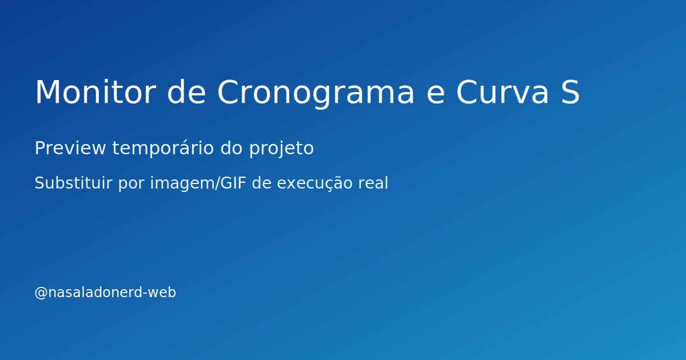

# Monitor de Cronograma e Curva S

> 🚧 **Em construção:** este projeto está sendo desenvolvido aos poucos, com entregas incrementais.

## Problema
Antecipar atrasos e desvios de custo com base em cronograma físico-financeiro e metas planejadas.

## Solução
Modelo em Python para cálculo de avanço planejado x realizado com visualização da curva S e indicadores de desempenho.

## Stack
- Python, pandas, matplotlib, numpy

## Resultado
- Estrutura inicial pronta para evolução incremental
- Base de código organizada para testes e documentação
- Repositório preparado para vitrine técnica no GitHub

## Demonstração


> Substitua depois por GIF real da execução (ex.: assets/demo.gif) assim que a primeira versão funcional estiver pronta.

## Status
**Estudo aplicado**

## Roadmap curto
- [ ] Implementar versão mínima funcional (MVP)
- [ ] Adicionar exemplo de entrada e saída
- [ ] Publicar GIF de execução no README
- [ ] Criar seção de lições aprendidas

## Como executar (placeholder)
```bash
# em breve
```

## Próxima entrega da semana
- [ ] Montar dataset de exemplo com planejado e realizado
- [ ] Implementar cálculo inicial da curva S acumulada
- [ ] Gerar visualização comparativa para identificar desvios
